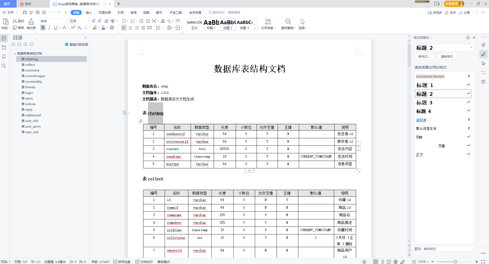
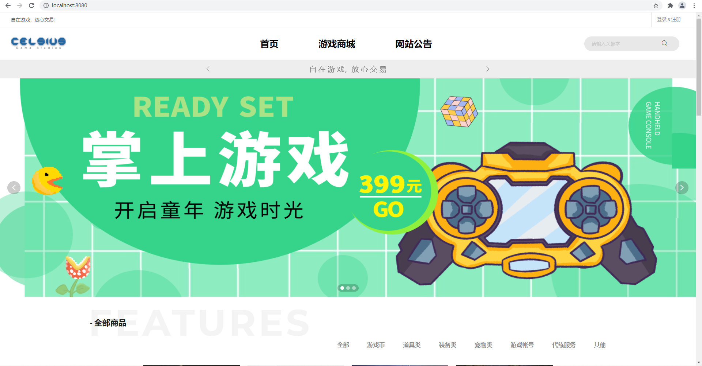
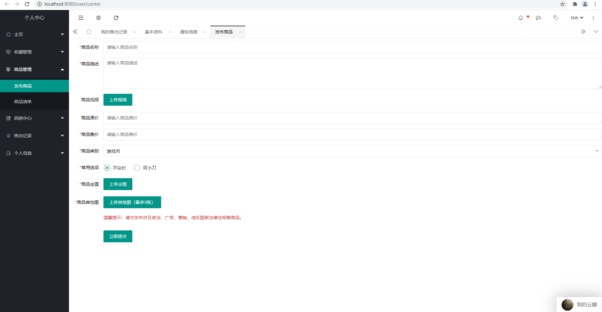
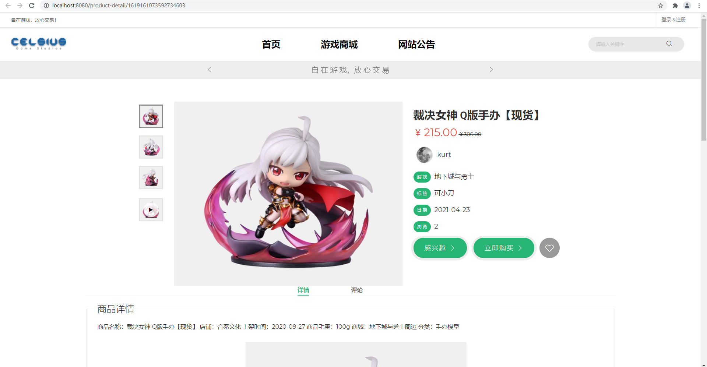
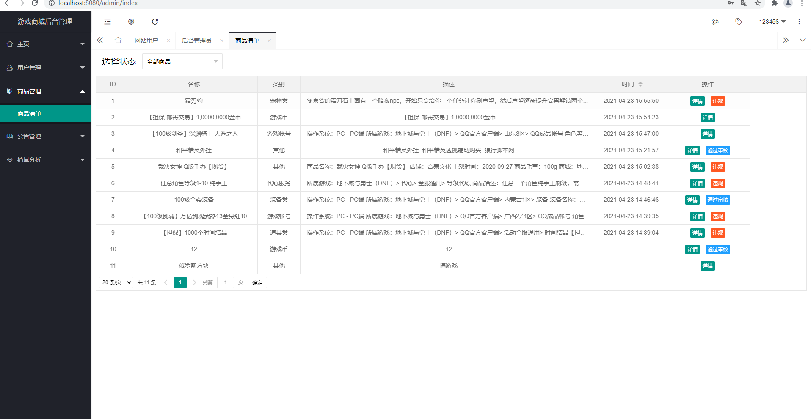

基于Springboot的在线游戏商城系统
=
### 完整代码获取地址：从戎源码网 ([https://armycodes.com/](https://armycodes.com/))
### 作者微信：19941326836  QQ：952045282 
### 承接计算机毕业设计、Java毕业设计、Python毕业设计、深度学习、机器学习
### 选题+开题报告+任务书+程序定制+安装调试+论文+答辩ppt 一条龙服务
### 所有选题地址https://github.com/nature924/allProject

一、项目介绍
---
基于Springboot框架实现的在线游戏商城系统包含两种角色：管理员、用户,系统分为前台和后台两大模块，主要功能如下。
### 【前台】功能：
1. 首页：展示游戏商城的主页，包括热门游戏、推荐游戏等信息。
2. 游戏商城：用户可以浏览和购买游戏商品，查看游戏详情、加入购物车、下单购买等。
3. 网站公告：展示网站的公告信息，如优惠活动、新游上架等。
4. 用户功能：用户可以进行以下操作：
   - 主页：展示用户的个人主页，包括已购游戏、收藏游戏等信息。
   - 收藏管理：用户可以管理自己收藏的游戏，包括添加、删除收藏。
   - 商品管理：用户可以查看自己购买的游戏商品的历史记录。
   - 消息中心：用户可以收到系统发送的通知消息，如订单状态更新、优惠活动等。
   - 售出记录：用户可以查看自己购买的游戏商品的历史记录。
   - 个人信息：用户可以管理自己的个人信息，包括用户名、头像、密码等。

### 【后台】功能：
1. 主页：展示管理员的主页，包括系统概览、最新订单等信息。
2. 收藏管理：管理员可以查看用户的收藏记录，并进行管理，如取消用户的收藏。
3. 商品管理：管理员可以管理游戏商品的信息，包括添加、编辑、删除商品。
4. 消息中心：管理员可以发送通知消息给用户，如订单状态更新、优惠活动等。
5. 售出记录：管理员可以查看所有用户的购买记录，并进行管理，如确认订单、发货等操作。

二、项目技术
---
- 编程语言：Java
- 数据库：MySQL
- 项目管理工具：Maven
- 前端技术：VUE、HTML、Jquery、Bootstrap
- 后端技术：Spring、SpringMVC、MyBatis

三、运行环境
---
- 操作系统：Windows、macOS都可以
- JDK版本：JDK1.8以上都可以
- 开发工具：IDEA、Ecplise、Myecplise都可以
- 数据库: MySQL5.7以上都可以
- Tomcat：任意版本都可以
- Maven：任意版本都可以

四、运行截图
---

### 程序截图：

